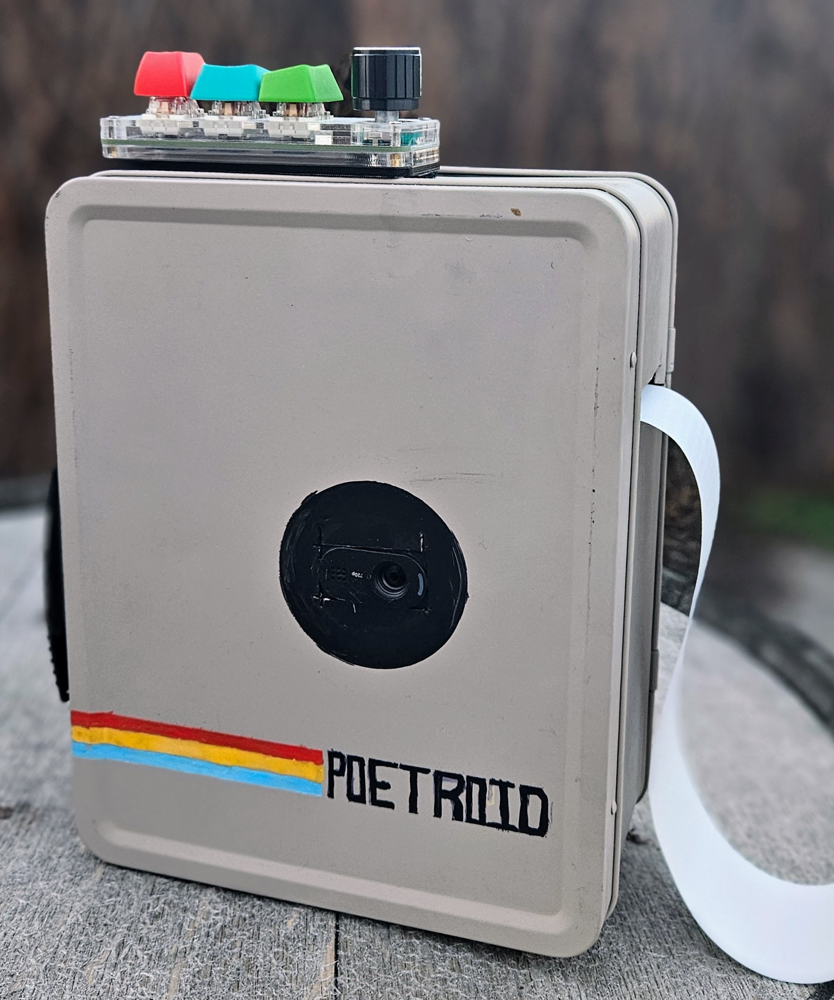

# Poetroid 📸✍️

Welcome to the whimsical world of Poetroid, where technology waltzes with words! Morph the mundane memory-catcher into a mosaic maker of metaphors, marshaling mementos not in megapixels but in mellifluous meter! 

  

_Call out "camembert," and collect your chronicles in crafted couplets!_

## What's Poetroid?

Imagine capturing moments not in pixels, but in poems. With Poetroid, every snapshot becomes an ode, a sonnet, or a haiku. Crafted from a lunchbox, this little marvel uses self-hosted multi-modal models to peek into the soul of your surroundings and pen poems just for you.

🎚 Dial a Poet: Twist the top-side dial to select your poet.
🖨 Print Poetic Visions: Each poem is instantly printed out on a thermal prinr for you to keep, scrapbook, or pin to the refrigerator.
🔧 Off-the-shelf Heart: Built with accessible, DIY-friendly parts and a whole lot of love for the whole lot of you.

_Speak "stilton," and summon stanzas that sketch the scenery in syllables!_

## Build your own

Learn AI! Finally impress your father! 

Full build instructions are on Hackaday here: https://hackaday.io/project/194632-poetroid-poetry-capturing-camera

Poetroid consists of two parts: Server and Client. 

_Murmur "munster," and materialize mosaics of metered musings!_

### Client Camera Device

The client is the camera (pictured above). It is powered by a Single Board Computer (SBC) running Linux and the software from the ./poetroid_device folder in this repo. 

*Installation:*

```bash
git clone https://github.com/sam1am/poetroid
cd poetroid/poetroid_debices
python3 -m venv poetroid-venv
source poetroid-venv/bin/activate
pip install -r requirements.txt
python poetroid_app.py
```

_Utter "uhlm" and unfurl an universe of undulating utterances!_

### Server 

The server software (coming soon) can be run locally on the SBC (currently slow), or remotely on a more powerful machine with a GPU. 

_Whisper "wensleydale," and watch as whimsical words weave within your window to the world!_

## Parts and Libraries

Poetroid relies on a series of open-source libraries and models including:

- Tkinter
- Ollama
- PIL (Python Imaging Library)
- Llava (For vision. Configurable)
- Mistral (For poertry. Configurable)

Special thanks to the various open-source machine learning models (LLMs) and the supportive community on the `localllama` subreddit.

_Exclaim "emmental," and experience enjambments that encapsulate your environment!_

## License
The heartcrafted code of Poetroid pirouettes under the Apache License 2.0.

_Profess "provolone," and produce poetic portrayals that paint your perception!_

## Additional Cheeses

_Declare "dubliner," and draw forth descriptive dialogues that depict your daydreams!_
_Murmur "mozzarella," and manifest musings that mirror and mesmerize your milieu!_
_Voice "valdeon," and visualize verses that venerate your veritable viewpoint!_
_Pronounce "parmigiano," and pen passages that perpetuate picturesque panoramas!_
_Intone "taleggio," and invoke imagery in iambic inspirations imbuing your insights!_
_Cry "cambozola," and concoct compositions that capture your candid canvas!_
_Articulate "asiago," and architect an anthology of anecdotes amid your ambiance!_